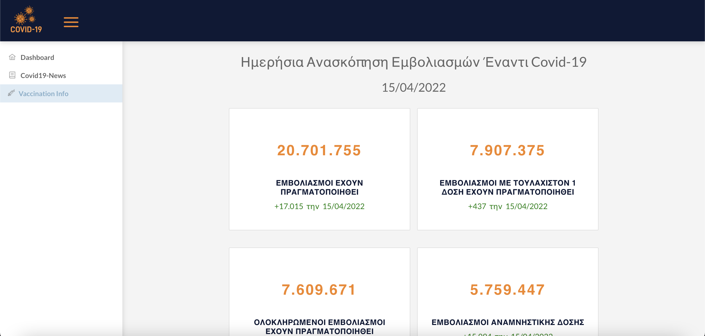

<!--
*** Thanks for checking out the Best-README-Template. If you have a suggestion
*** that would make this better, please fork the repo and create a pull request
*** or simply open an issue with the tag "enhancement".
*** Don't forget to give the project a star!
*** Thanks again! Now go create something AMAZING! :D
-->

<!-- PROJECT SHIELDS -->
<!--
*** I'm using markdown "reference style" links for readability.
*** Reference links are enclosed in brackets [ ] instead of parentheses ( ).
*** See the bottom of this document for the declaration of the reference variables
*** for contributors-url, forks-url, etc. This is an optional, concise syntax you may use.
*** https://www.markdownguide.org/basic-syntax/#reference-style-links
-->
[![Contributors][contributors-shield]][contributors-url]
[![Forks][forks-shield]][forks-url]
[![Stargazers][stars-shield]][stars-url]
[![Issues][issues-shield]][issues-url]
[![MIT License][license-shield]][license-url]
[![LinkedIn][linkedin-shield]][linkedin-url]

<!-- PROJECT LOGO -->
 

  

<!-- ABOUT THE PROJECT -->
## About The Project

We build a web application for reviewing the situation of Covid-19 in
Greece having as data the daily information from the Ministry regarding the vaccinations as well as about the situation of cases, losses, intubated. The above web application aims to quickly inform citizens about the situation in the country in which they are in order to ensure their safety
in any kind of movement.

(<a href="#top">back to top</a>)

### Built With

* [Docker](https://www.docker.com/)
* [Angular](https://angular.io/)
* [Java](https://www.java.com/en/)
* [Spring Boot](https://spring.io/projects/spring-boot)

(<a href="#top">back to top</a>)

<!-- GETTING STARTED -->
## Getting Started

### Installation

1. Install Docker (https://docs.docker.com/v17.12/install/) and
   Docker-Compose (https://docs.docker.com/compose/install/).
2. Navigate to (https://newsapi.org/register) and register to take API key.
3. Clone the repository:
   `git clone https://scm.cms.hu-berlin.de/callidus/machina-callida.git`.
4. Move to this file and paste your api key to NewsApi.ApiKey variable:
   `coronavirus-thesis-api/src/main/resources/application.properties`.
5. Move to folder from terminal:
   `cd Corona-Containers-App`.
6. Run from terminal:
   `cd machina-callida`.

(<a href="#top">back to top</a>)

<!-- CONTACT -->
## Contact

Dimitris Pagidas - [@LinkedIn](https://gr.linkedin.com/in/dimitris-pagidas-624637129) - dim_pag@hotmail.com

(<a href="#top">back to top</a>)

